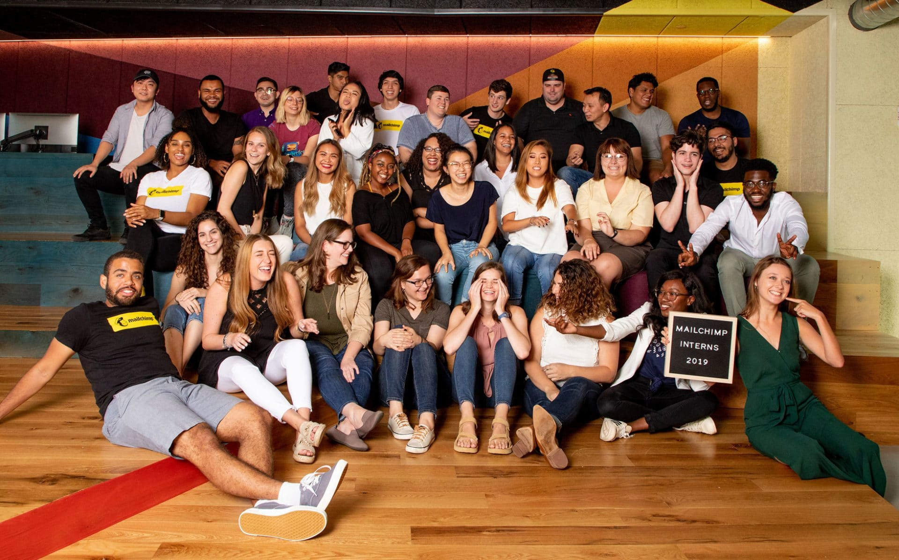

**12 incredible Weeks as a UX Designer Intern**

  

  
There would be so many things and anecdotes to talk about which contributed to making my internship experience at Mailchimp truly unique.  

And a simple blog post cannot capture all the magic concentrated in the span of _12 weeks_, so I am just going to highlight a few key aspects that made this summer absolutely unforgettable.  

Working with the Design System team as a UX Engineer has been such an exciting part of my journey to Atlanta, and it made me understand about how important it is to have a great sense of team work and cooperation when starting to conceptualise the building blocks of a whole new Design System.  

As a matter of fact, having a clear sense of _direction_ and a _vision_ is not enough, as the mission of a _Design System_ team is to standardise and make the visual elements of a User Experience fully accessible, well-documented and completely in-line with the company vision and strategy.  

It is no easy task, believe me.  

But that’s part and parcel of the fun of it.  

Using the latest technologies and frameworks to bring to life the _User Interface_ of a product is such a great and _empowering_ feeling, and being able to actively contribute to the various discussions with the team and receiving feedback along the way, makes the whole process so much smoother and enjoyable.  

I feel so **lucky** to have had this opportunity to work with such _talented people_, and every day felt like a whole new chapter to continue _being inspired_ and motivated to see things grow and change.
