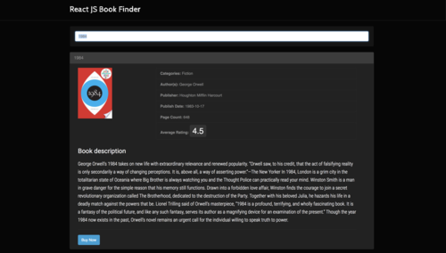

I built this Book Finder Web App using [React.js](https://reactjs.org/), and integrated it with the [Google Books API](https://developers.google.com/books/) in order to fetch the books data and make the user able to browse through the list using a responsive Bootstrap accordion panel.

Check out the [Github repo](https://github.com/vale-c/ReactJS_BookFinder) with the full code.

A [live demo](https://bookfinderapp.netlify.com/) website is also available.
