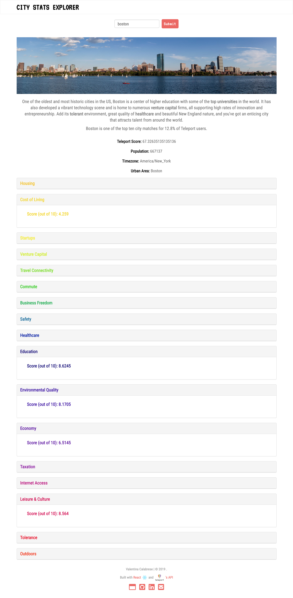

  
A React Web App inspired by the Momentum Dashboard.
  
Check out the live version of this project!
  

- It is Bootstrapped with “Create React App“.
- It uses the Unsplash API to fetch an awesome wallpaper for every refresh.
- It uses the Forismatic API to get random interesting Quotes every time.
- It uses Geolocation to get accurate info about your current location.
- It uses OpenWeather API integration to get precise Weather Data.
