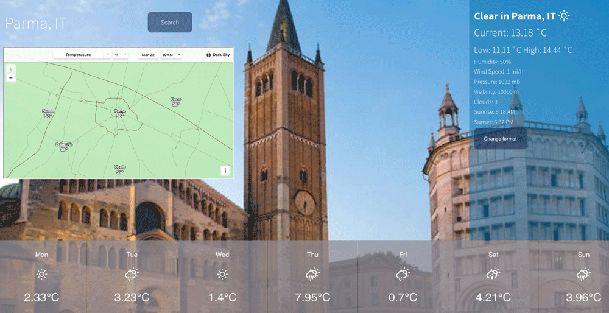

This Weather App is built using React.js, and integrated with two external APIs (OpenWeather and DarkSky) in order to fetch real-time weather data, and make the user able to view an accurate forecast for the upcoming week as well as other useful weather info.

A live demo can be found here.
The full repo with the code is here.
